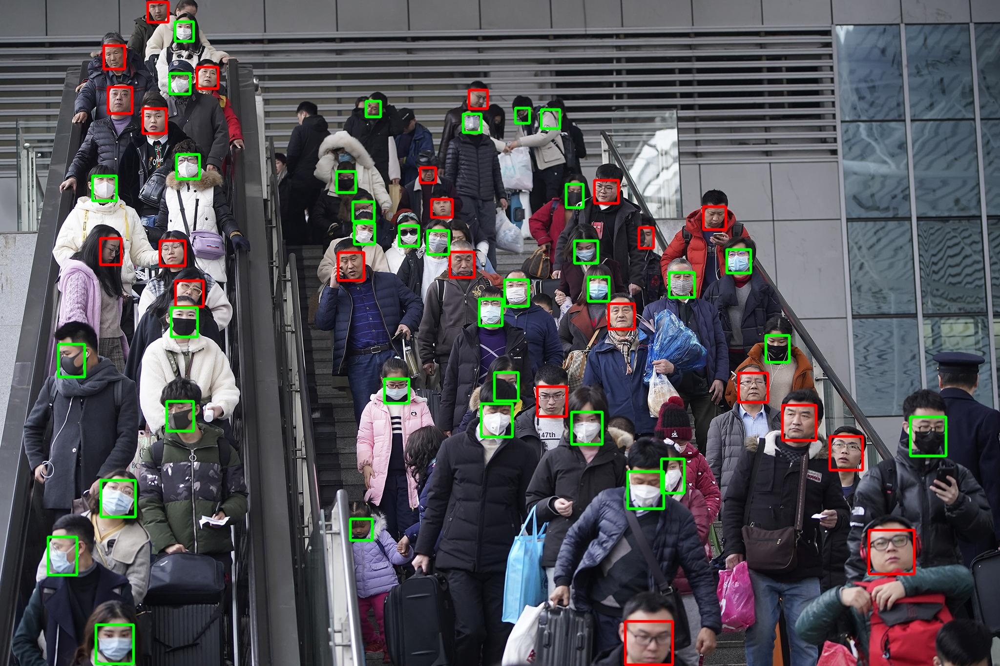
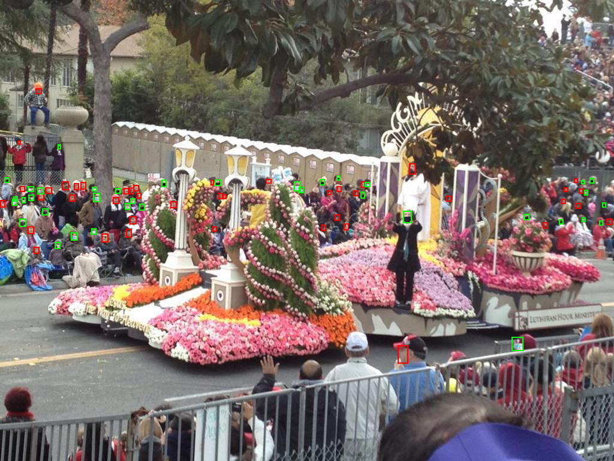

# Real time Face Mask Detector
This repository represents face mask detector, based on [ultralytics YOLOv5s](https://github.com/ultralytics/yolov5) model and trained on custom dataset


## Quick start

1. Install:
    ```bash
    git clone https://github.com/IvanKurnosov/mask_detector # clone repo
    cd mask_detector
    pip install -r requirements.txt # install requirements.txt
    ```
   
2. Run:
    ```bash
    python detect.py --source data/images/faces.jpg
    ```



This repo is a clone of [ultralytisc/yolov5](https://github.com/ultralytics/yolov5) with little changes. If you have it already installed, you may download weights/yolov5s_mask_detector_weights.pt and get a similar result by running:    
```bash 
python detect.py --weights weights/yolov5s_mask_detector_weights.pt --img 1024 --conf 0.5 --source data/images/faces.jpg
```

## Training
The main problem in creating this detector was to generate good dataset.
I found two face mask datasets: [MedicalMaskDatasetImagesTfrecords](https://www.kaggle.com/ivandanilovich/medical-masks-dataset-images-tfrecords) and [KaggleFaceMaskDetection](https://www.kaggle.com/andrewmvd/face-mask-detection). Both of them are not bad but they don't go into any comparison with [WiderFace](http://shuoyang1213.me/WIDERFACE/) for example. So if you just train on this datasets, the model can't detect small or bad illuminated faces. After few experiments, I found two ways to ease this problems:
1. First is to pretrain model on WiderFace dataset and then train on both face mask dataset. It's improve results and you may use this model by running 
   ```bash
    python detect.py --weights weights/yolov5s_mask_detector_wider_pretrained_weights.pt --source data/images/faces.jpg
    ```

2. Second is to 'wear' masks on 50% WiderFace datacet faces and use it together with mask datasets. It provides class balance and different lightnings, scales and positions. The disadvantage is that I use only 23 mask and they are weared on faces in similar way. You may find masks at  ```data/images/masks.zip```. This model is used by default.

   

## Source code
All dataset generating  and model training code stored in ```scripts/``` folder:
1. WiderFace pretrained model:
```
wider_face_to_darknet.ipynb  # transform WiderFace dataset to Darknet format
wider_face_detector_train.ipynb  # train face detector
wider_pretrained_mask_detector train  # train mask detector
```

2. Custom WiderFace model:
```
custom_wider_kaggle_to_darknet.ipynb  # wear masks on WiderFace, union with Kaggle datasets and trainsform to Darknet format
mask_detector_custom_dataset_train.ipynb  # train mask detector
```

3. Both models use the same Yaml files:
```
faces.yaml  # to describe dataset
yolov5s.yaml  # to setup network
```

